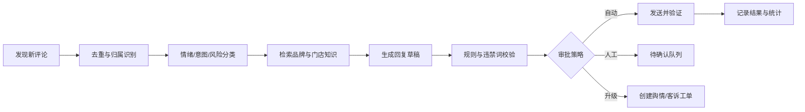

# 01 总体方案与产品需求

## 1. 文档目的

设计一款面向美业商家及连锁总部的 Android 智能口碑运营应用。应用接入大模型 API 和商家知识库，在用户授权的手机上协助操作抖音、美团/大众点评、小红书，完成评论处理、相关内容发现、品牌互动建议和负面舆情上报。

本方案既是产品需求文档，也是后续研发立项、范围控制和验收的基准。

## 2. 产品定位

产品暂定代号：`Lobster for Android`。

一句话定位：

> 帮助商家在一台 Android 手机上集中处理多平台评论、发现潜在客户话题，并把负面舆情自动转化为可跟进工单。

产品不做传统“群控”或账号农场，不代用户注册账号，不保存账号密码，不伪造评价；只服务已授权的企业、门店和账号。

## 3. 用户角色

| 角色 | 权限与目标 |
|---|---|
| 总部管理员 | 创建组织、区域、门店；分配账号和设备；配置品牌知识库、全局规则和舆情词；查看全局报表 |
| 区域负责人 | 管理所辖门店；审批高风险回复；接收区域 P0/P1 告警 |
| 门店店长 | 处理本店评论、查看待办、维护门店信息和服务补救结果 |
| 运营人员 | 执行评论回复、话题发现、线索标注和日常互动 |
| 公关负责人 | 维护监控词、审批危机回应、管理舆情事件和复盘 |
| 审计人员 | 只读查看操作人、设备、模型输出、审批链和最终发送内容 |
| 设备 Agent | 在绑定设备上接收任务、感知页面、执行动作、验证并回传结果 |

## 4. 业务边界

### 4.1 支持范围

- 自有账号、自有门店和明确授权账号的评论管理。
- 对品牌名、门店名、产品名及经过审核的相关关键词进行监控。
- 对可公开访问内容进行相关性、情绪和风险分析。
- 根据商家知识库生成个性化回复草稿。
- 按风险等级自动发送、人工确认或升级处理。
- 收集执行结果和运营指标，形成门店改进建议。

### 4.2 不进入范围

- 批量注册、养号、账号租赁和账号交易。
- 模拟虚假消费者发布评价。
- 代替消费者撰写、修改或删除评价。
- 使用未授权账号攻击竞品或组织虚假互动。
- 绕过验证码、设备验证、平台安全限制或用户授权界面。
- 通过隐藏、伪装或注入方式规避平台检测。

## 5. 三种业务模式

### 5.1 前台模式

负责“自己的阵地”，包括自有作品评论、自有门店评价和商家账号收到的咨询。

#### 5.1.1 输入

- 平台官方 API 事件或轮询结果。
- Android 系统通知。
- 商家 App 内的评价列表和评论列表。
- 用户主动选择的评论或任务。

#### 5.1.2 标准流程



#### 5.1.3 评论分类

- 咨询：价格、地址、营业时间、预约、停车、项目时长。
- 服务：态度、等待时间、卫生、环境、手法、推销感受。
- 产品：成分、使用方法、适用肤质、使用反应、真伪。
- 售后：退款、补做、过敏、受伤、隐私、支付或核销问题。
- 口碑：表扬、复购、推荐、一般反馈。
- 风险：医疗功效争议、人身伤害、群体投诉、媒体或达人曝光。

#### 5.1.4 自动化等级

| 等级 | 行为 |
|---|---|
| L0 监控 | 只采集和分析，不生成回复 |
| L1 草稿 | 自动生成草稿，由人工发送 |
| L2 半自动 | 低风险自动发送，中高风险人工审批 |
| L3 托管 | 白名单意图和话术可自动处理，其余进入人工队列 |

### 5.2 逛街模式

负责“发现机会”，但产品定义为相关内容发现和合规互动辅助，不定义为无差别自动营销。

#### 5.2.1 输入条件

- 城市、行政区、商圈、门店半径。
- 品牌、项目、产品、场景和用户问题关键词。
- 平台热点、搜索结果、同城内容或经过官方接口返回的品牌相关内容。

#### 5.2.2 机会评分

```text
OpportunityScore =
  0.30 * 业务相关度
+ 0.20 * 本地相关度
+ 0.15 * 用户咨询意图
+ 0.15 * 内容时效性
+ 0.10 * 内容互动质量
+ 0.10 * 品牌安全系数
```

低于阈值只记录；达到阈值生成建议；只有平台能力、账号权限和审批策略都允许时才执行互动。

采用两阶段筛选，避免无差别访问和回复：

1. **内容与评论初筛**：先根据作品主题、城市、发布时间、评论内容和咨询意图判断相关性。
2. **候选人公开信息复核**：只对初筛入围对象查看公开主页，结合平台 ID、头像类型、简介、公开地区、近期相关发言和当前对话上下文形成候选摘要。

候选摘要只判断可观察的业务角色和需求，例如“内容作者、现有客户、明确咨询者、本地潜在客户、同行、无关访客”，不根据头像推断年龄、性别、健康、收入、职业或人格。

#### 5.2.3 互动类型

- 专业知识补充。
- 对明确咨询提供公开、简短、可验证的信息。
- 提醒用户通过平台内官方门店页查看地址、项目和预约信息。
- 对与品牌无关、竞品专属或无商业意图的话题不介入。
- 对作品作者和评论区访客分别生成话术：作者侧重作品主题和专业补充，访客侧重其具体问题和当前对话。
- 点赞只用于表达对真实、有价值内容的认可，不与批量回复绑定，不对投诉、伤害、隐私或争议内容自动点赞。

#### 5.2.4 默认控制

- 默认“发现 + 草稿 + 人工确认”。
- 每个平台、账号、门店分别设置日限额。
- 相似回复去重；禁止模板连续重复。
- 每次回复前读取作品正文/标题、目标评论、父级对话和相邻评论，避免脱离语境。
- 写操作受平台能力、账号级质量预算、人工审批和异常熔断共同控制，不采用随机点击或伪装行为规避平台检测。
- 不主动索要微信、手机号等站外联系方式。
- 遇到验证码、登录验证、违规提示或发送失败立即停止该账号任务。

### 5.3 公关模式

负责“品牌风险发现和处置”。

#### 5.3.1 监控词体系

- 品牌标准名、旧名、简称和常见错别字。
- 门店名、地址、商圈、店长或公开主理人名称。
- 产品和服务项目名。
- “投诉、退款、诱导消费、过敏、毁容、烂脸、感染、欺诈”等风险词。
- 品牌名与风险词的组合。
- 经法务和业务批准的行业词；不默认监控竞品并进行营销互动。

#### 5.3.2 风险等级

| 等级 | 定义 | 系统动作 |
|---|---|---|
| P3 | 普通吐槽、低传播、无明确损害 | 进入日报，生成安抚草稿 |
| P2 | 明确客诉、多人附和或门店责任待核实 | 通知店长，创建 4 小时处理工单 |
| P1 | 高赞负面、达人内容、跨平台扩散 | 通知区域和总部，暂停自动回应，1 小时内处理 |
| P0 | 人身伤害、监管/媒体介入、集中投诉 | 即时告警，启动危机流程，只允许公关负责人发布 |

#### 5.3.3 舆情事件生命周期

```text
NEW → TRIAGED → INVESTIGATING → RESPONSE_DRAFTED
→ APPROVED → RESPONDED → MONITORING → RESOLVED → REVIEWED
```

公关模式对互动对象使用与逛街模式相同的公开信息复核，但目标从“转化潜力”切换为“事件相关性、影响力、诉求明确度和回应必要性”。负面评论中的普通参与者不因为表达负面观点就被标记为风险人员。

## 6. 核心功能清单

### 6.1 Android 客户端

- 组织登录和设备绑定。
- 权限向导与设备健康检查。
- 平台账号绑定状态展示。
- 三模式开关、运行时间和任务范围配置。
- 实时任务卡片、待确认队列和紧急停止按钮。
- 当前执行步骤可视化。
- 评论详情、模型草稿、知识来源和风险命中展示。
- 人工修改、批准、拒绝、升级。
- 失败截图和人工接管入口。
- 设备本地加密缓存和断点续传。

### 6.2 Web 管理后台

- 总部—区域—门店三级组织管理。
- 用户、角色、设备和平台账号管理。
- 品牌、门店、服务项目、产品和 FAQ 知识库。
- 关键词、风险词、违禁词和审批策略。
- 任务中心、评论中心、舆情中心和客诉工单。
- 话术模板和品牌语气管理。
- 运营报表、门店对比和问题归因。
- 审计日志、模型成本和设备健康监控。

### 6.3 AI 能力

- OCR 与页面语义理解。
- 评论意图、情绪、紧急度、业务归属分类。
- 广告、医疗、美业功效和隐私信息检测。
- 基于知识库的回复生成。
- 多轮客诉摘要与证据整理。
- 负面内容传播风险评分。
- 门店问题聚类和运营建议。

## 7. 非功能指标

| 指标 | MVP | 商用目标 |
|---|---:|---:|
| 低风险评论分类准确率 | ≥90% | ≥95% |
| P0/P1 风险召回率 | ≥95% | ≥98% |
| Android 页面动作成功率 | ≥90% | ≥97% |
| 错账号发送率 | 0 | 0 |
| 重复发送率 | ≤0.1% | ≤0.01% |
| API 路径评论同步延迟 | ≤5 分钟 | ≤60 秒 |
| UI 路径单条处理时间 | ≤90 秒 | ≤45 秒 |
| 审计日志完整率 | 100% | 100% |
| 服务端月可用性 | 99.5% | 99.9% |

## 8. MVP 范围

### 8.1 第一阶段必须交付

- Android 12～16。
- 抖音自有视频评论：优先官方评论 API。
- 美团经营宝自有门店评价：先完成 UI 适配和人工确认回复。
- 小红书自有账号：评论发现、草稿和人工确认，不默认自动发送。
- 企业、区域、门店、账号和设备模型。
- 评论分类、知识库回复、风险审查、审计日志。
- 一键停止和账号异常熔断。

### 8.2 延后功能

- 多品牌集团。
- iOS 客户端。
- 全自动逛街互动。
- 跨平台统一私信客服。
- 复杂 CRM、会员和营销自动化。
- 云手机大规模调度。

## 9. 成功指标

- 评论平均首次响应时间下降 60%。
- 人工处理单条评论时间下降 70%。
- 低风险评论自动或半自动覆盖率达到 60%。
- P0/P1 漏报率低于 2%。
- 门店重复问题可归因率达到 80%。
- 因错账号、错门店、错话术产生的严重事故为零。
