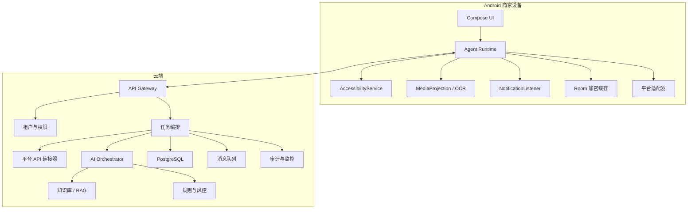
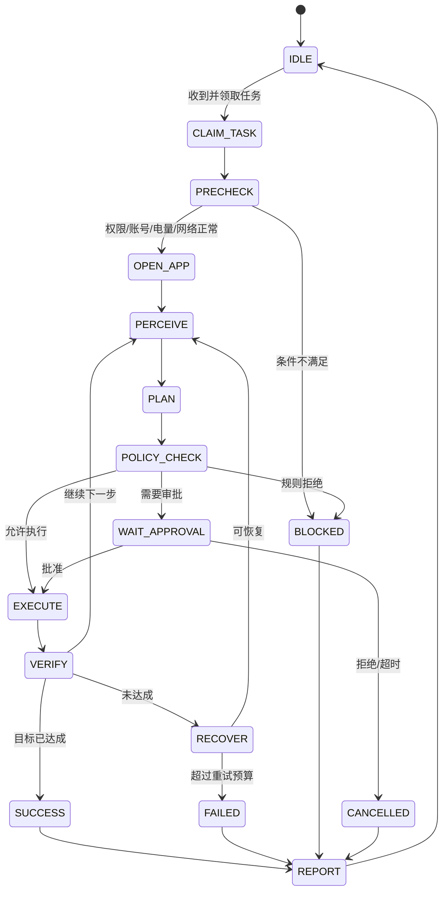

# 02 系统架构与 Android 执行引擎

## 1. 总体架构

采用“官方 API + Android Agent + 云端业务平台”的混合架构。



## 2. 技术选型

### 2.1 Android

- Kotlin。
- Jetpack Compose。
- Coroutines、Flow。
- Hilt 依赖注入。
- Room 本地数据库。
- DataStore 保存非敏感配置。
- Android Keystore 保存设备密钥。
- WorkManager 处理可延期同步。
- Foreground Service 处理用户可见的持续任务。
- Retrofit/OkHttp 或 Ktor Client。
- ML Kit OCR 作为本地文字识别首选。

### 2.2 服务端

- FastAPI 或 NestJS；团队有 Java 基础时可选择 Spring Boot。
- PostgreSQL + `pgvector`。
- Redis：锁、限流、短期任务状态。
- RabbitMQ/Kafka：任务和事件流。
- S3 兼容对象存储：经过脱敏的截图和证据附件。
- OpenTelemetry + Prometheus + Grafana + Loki/ELK。
- WebSocket 或 MQTT：设备任务下发与心跳。

## 3. Android 权限设计

| 权限/能力 | 用途 | 必需性 | 触发时机 |
|---|---|---|---|
| `AccessibilityService` | 读取节点、点击、输入、滚动、返回 | UI 适配路径必需 | 用户启用某平台 UI 辅助时 |
| `MediaProjection` | 截图、OCR、视觉兜底 | 条件必需 | 首次需要视觉识别时单独请求 |
| `NotificationListenerService` | 发现评论或商家通知 | 推荐 | 开启前台模式时 |
| `POST_NOTIFICATIONS` | 显示运行、审批、告警通知 | 必需 | 首次开启运行模式时 |
| Foreground Service | 持续执行且显示系统通知 | 必需 | 运行 UI Agent 时 |
| `UsageStatsManager` | 判断前台 App 和使用状态 | 可选 | 仅节点事件无法判断时 |
| 悬浮窗 | 状态提示、暂停和人工接管 | 可选 | 用户主动开启 |
| Device Owner/DPC | 企业专用设备策略和远程维护 | 企业版 | 设备初始化/企业配置时 |

权限按功能渐进申请，不在首次启动时一次性索取。Android 官方要求 MediaProjection 在每次有效采集会话前由用户确认；Android 15 及以上不能从 `BOOT_COMPLETED` 直接启动媒体投影前台服务。

## 4. Android 模块划分

```text
app
├── core-common
├── core-network
├── core-database
├── core-security
├── core-observability
├── feature-onboarding
├── feature-device-binding
├── feature-task-center
├── feature-approval
├── feature-settings
├── agent-runtime
├── agent-perception
├── agent-action
├── agent-policy
├── adapter-douyin
├── adapter-meituan
├── adapter-xiaohongshu
└── platform-enterprise
```

## 5. Agent 运行循环



大模型只能输出结构化“意图计划”，不能直接无限制控制设备。执行器只能调用白名单动作，并受状态机、风险策略和重试预算限制。

## 6. 页面感知模型

### 6.1 感知优先级

1. Accessibility 节点树。
2. 节点文字、content description、资源 ID 和层级关系。
3. 屏幕 OCR。
4. 视觉模型判断页面类型和局部元素。
5. 坐标模板，仅作为最终兜底。

### 6.2 标准快照

```json
{
  "snapshotId": "uuid",
  "deviceId": "uuid",
  "packageName": "com.example.platform",
  "appVersion": "1.2.3",
  "activityName": "...",
  "capturedAt": "2026-07-10T10:00:00+08:00",
  "screenWidth": 1080,
  "screenHeight": 2400,
  "pageType": "COMMENT_DETAIL",
  "nodes": [],
  "ocrBlocks": [],
  "screenshotObjectKey": "redacted/...",
  "screenHash": "sha256",
  "confidence": 0.96
}
```

### 6.3 页面指纹

每个平台页面定义版本化指纹：

```yaml
pageType: COMMENT_DETAIL
adapter: douyin
version: 3
requiredAny:
  - text: "回复"
  - contentDescription: "评论"
forbiddenAny:
  - text: "登录"
  - text: "账号存在风险"
confidenceThreshold: 0.85
```

## 7. 动作原语

执行器只支持以下白名单动作：

- `OPEN_PACKAGE(packageName)`
- `OPEN_DEEP_LINK(uri)`
- `FIND_NODE(selector)`
- `CLICK_NODE(nodeId)`
- `LONG_CLICK_NODE(nodeId)`
- `SET_TEXT(nodeId, text)`
- `SCROLL(direction, amount)`
- `SWIPE(path)`
- `GLOBAL_BACK`
- `WAIT(condition, timeout)`
- `CAPTURE_SCREEN(region)`
- `ASSERT_PAGE(pageType)`
- `ASSERT_TEXT(text)`
- `REQUEST_HUMAN(reason)`
- `STOP(reason)`

禁止执行任意 Shell 命令、读取其他应用私有目录或修改系统安全设置。

## 8. 元素定位策略

定位器按稳定性排序：

```text
resourceId
→ contentDescription
→ exactText
→ semanticRole + nearbyText
→ hierarchyPath
→ OCR text bounding box
→ normalized coordinate
```

选择器必须允许多语言、文字轻微变化和 A/B 页面。每个选择器记录成功率，低于阈值自动降级并创建适配器维护任务。

## 9. 文本输入策略

- 首选 `ACTION_SET_TEXT`。
- 不支持时聚焦输入框并使用无障碍输入法能力。
- 发送前重新读取输入框，确认文本完整一致。
- 检查 Unicode、表情、换行和最大长度。
- 发送按钮点击前再次校验当前账号、目标评论和最终文本摘要。
- 发送后读取页面或通知确认成功；无法确认时标记 `UNKNOWN`，不得自动重复发送。

## 10. 任务幂等与并发

- 每条业务动作使用 `idempotencyKey`。
- 一个账号同一时刻最多一个写任务。
- 一个设备同一时刻最多一个 UI 执行任务。
- API 写入和 UI 写入不能同时操作同一评论。
- 发送状态采用 `PENDING → EXECUTING → UNKNOWN/SUCCEEDED/FAILED`。
- `UNKNOWN` 必须先重新读取目标页面，确认未发送后才能重试。

## 11. 错误恢复

| 错误 | 恢复动作 |
|---|---|
| 页面不匹配 | 返回一次，重新从稳定入口进入 |
| 节点不存在 | 刷新节点树，OCR 兜底；仍失败则停止 |
| 网络错误 | 指数退避，最多三次 |
| App 崩溃 | 重新启动一次，从检查点继续 |
| 账号退出 | 停止账号全部任务并通知用户登录 |
| 验证码/安全验证 | 立即停止并请求人工处理 |
| 发送状态未知 | 重新查询评论，不直接重复发送 |
| 页面版本变化 | 熔断该适配器版本，切换草稿模式 |

## 12. 紧急停止与人工接管

- App 首页永久显示“停止全部自动操作”。
- 前台服务通知包含暂停按钮。
- 悬浮球开启时包含暂停和截图上报。
- 服务端可按组织、门店、账号、平台或设备熔断。
- 锁屏、通话、低电量、过热、移动网络受限时暂停 UI 任务。
- 用户触摸屏幕后，Agent 默认暂停 30 秒，避免与人工争夺焦点。

## 13. 适配器版本管理

适配器由代码和签名配置组成：

- `adapterVersion`：适配逻辑版本。
- `supportedAppVersions`：已验证平台 App 版本范围。
- `pageFingerprints`：页面指纹。
- `selectors`：节点和 OCR 选择器。
- `featureFlags`：可远程关闭具体动作。
- `killSwitch`：紧急熔断。

远程配置必须数字签名；客户端只加载可信配置。涉及新执行能力的变更必须发版，不通过远程脚本注入任意逻辑。

## 14. 设备绑定与身份

1. 用户登录企业账号。
2. 服务端生成一次性绑定码。
3. 客户端在 Android Keystore 生成设备密钥对。
4. 上传公钥、设备证明和基础环境信息。
5. 服务端签发短期设备证书。
6. 后续任务使用双向认证或签名请求。
7. 解绑后撤销设备证书并清除本地业务缓存。

## 15. 官方技术参考

- [Android AccessibilityService](https://developer.android.com/guide/topics/ui/accessibility/service)
- [Android Foreground Service Types](https://developer.android.com/develop/background-work/services/fgs/service-types)
- [Android Enterprise Device Control](https://developer.android.com/work/dpc/device-management)
- [Google Play AccessibilityService Policy](https://support.google.com/googleplay/android-developer/answer/10964491)

