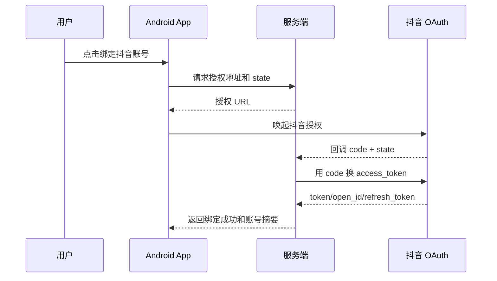

# 03 抖音、美团、小红书平台适配方案

## 1. 总体原则

三平台采用不同接入策略，不能假设所有平台都开放相同能力。

优先级：

```text
官方 Open API / 商家接口
→ 官方商家后台或官方服务商能力
→ 用户可见、可暂停的 Android 辅助操作
→ 只生成草稿并由用户手动发送
```

## 2. 能力矩阵

| 能力 | 抖音 | 美团/大众点评 | 小红书 |
|---|---|---|---|
| 自有内容评论读取 | 官方 API 可申请 | 商家端可见；公开评论 API 需商务确认 | 社区评论公开 API 未确认开放 |
| 自有内容评论回复 | 官方 API 可申请 | 经营宝支持商家回应；API 需商务确认 | 默认草稿 + 人工确认 |
| 品牌关键词内容搜索 | 官方“关键词视频管理”可申请 | 商家端搜索/评价入口有限 | 社区搜索 API 未确认开放 |
| 相关内容下评论回复 | 抖音特殊权限允许品牌相关关键词场景 | 不作为首期自动化目标 | 默认不自动执行 |
| 商家评价申诉 | 依业务入口 | 经营宝支持违规评价投诉 | 按官方 App 入口人工处理 |
| 电商订单/商品 API | 有对应开放能力，按资质申请 | 餐饮/零售开放平台按资质申请 | 电商开放平台明确开放 |
| 推荐接入方式 | API 优先，UI 兜底 | 商家端/UI + 服务商合作 | 监控/草稿/人工确认为主 |

---

# 3. 抖音适配方案

## 3.1 官方能力基线

抖音开放平台明确提供：

- OAuth 2.0 授权。
- 授权账号视频列表和数据。
- 视频评论列表、评论回复列表和回复评论。
- 企业号置顶评论。
- “关键词视频管理”：对与自身品牌或产品相关的关键词搜索最近内容、读取评论并进行回复。

关键 Scope：

| Scope | 用途 |
|---|---|
| `video.list` | 查询授权账号视频列表 |
| `video.data` | 查询授权账号特定视频数据 |
| `video.comment` | 自有视频评论管理方案中的评论读取和回复 |
| `video.search` | 搜索经审核的品牌相关关键词视频 |
| `video.search.comment` | 读取和回复关键词视频下评论 |
| `hotsearch` | 热点能力，需单独申请，不能替代品牌相关搜索 |

官方“关键词视频管理”限制包括：关键词必须与自身业务紧密相关，不可申请通用品类词或竞品品牌词；搜索结果强调时效性，仅返回最近一天发布的公开视频。因此抖音公关模式应优先走该能力，而不是通过 UI 无限制搜索。

## 3.2 抖音账号授权



- `client_secret`、`access_token` 和 `refresh_token` 只保存在服务端密钥系统。
- Android 客户端只持有本产品的短期会话和平台账号绑定 ID。
- 每次授权保存 scope、授权时间、过期时间和授权人。
- 解除授权事件应同步禁用账号任务。

## 3.3 抖音前台模式

### API 路径

1. 拉取或接收授权账号视频列表变化。
2. 获取视频评论列表。
3. 以 `platformCommentId` 去重。
4. 完成 AI 分类、知识检索和审批。
5. 调用评论回复接口。
6. 再读取评论回复列表验证。
7. 写入统一评论表和审计日志。

### UI 兜底路径

仅当 API 权限尚未通过或特定商家端能力未开放时使用：

```text
打开抖音 → 我 → 目标作品/消息入口 → 评论列表
→ 定位目标评论 → 打开回复输入框 → 设置文本
→ 校验账号、评论作者、评论摘要 → 点击发送 → 验证
```

## 3.4 抖音逛街模式

- 首选经审核的 `video.search` 和 `video.search.comment`。
- 搜索词只来自已批准的品牌、产品、门店和活动词库。
- 通用行业词、竞品词默认只做内部研究，不自动回复。
- 内容相关性低于 0.8 不进入回复队列。
- 默认人工确认；只有明确咨询、事实型回答和低风险场景可以进入白名单自动回复。
- 先分析视频标题、作者、发布时间、地点和评论区主题，再对高分评论者读取公开主页摘要。
- 区分视频作者、评论发起者和跟评访客；回复必须引用其实际问题或所在对话，不生成无上下文营销模板。
- 点赞和回复分别决策；没有官方写能力时进入 Android 辅助或人工队列，不把点赞作为批量“预热”动作。

## 3.5 抖音公关模式

- 关键词搜索结果建立 `Mention`。
- 对视频标题、作者、发布时间、互动量和评论情绪做快照。
- 负面内容创建 `Incident` 并持续拉取评论变化。
- P0/P1 不自动回击，由公关负责人审批。
- 回复优先解决事实、服务和售后问题，不公开争论个人体验。
- 对作者评估内容传播角色和与品牌的实际关系；对评论者重点评估诉求、是否为真实经历陈述、是否在追问解决方案以及是否可能扩大事件。
- 仅使用抖音公开主页和当前事件上下文，不跨平台拼接个人身份。

## 3.6 抖音适配器页面

UI 兜底至少维护：

- 首页/消息页。
- 个人主页。
- 作品详情。
- 评论面板。
- 评论回复输入态。
- 搜索页和搜索结果页。
- 风险提示、验证码和登录页。

## 3.7 抖音官方参考

- [抖音总体授权说明](https://open.douyin.com/platform/resource/docs/develop/permission/overall-permission/)
- [视频评论管理接入方案](https://open.douyin.com/platform/resource/docs/ability/interaction-management/video-comment-management-solution)
- [视频搜索管理接入方案](https://open.douyin.com/platform/resource/docs/ability/search-management/video/)
- [用户类型及权限说明](https://open.douyin.com/platform/resource/docs/accession-guide/type-and-permission)

---

# 4. 美团/大众点评适配方案

## 4.1 产品入口

美业门店重点适配：

- 美团经营宝/开店宝的评价管理。
- 美团到店服务零售商家评价。
- 大众点评商户评价回应。
- 违规评价投诉和证据提交。

公开规则确认商家可以通过经营宝评价回应功能处理评价。公开开发者资料中未确认面向普通第三方开放完整的到店评价读取与回复 API，因此第一阶段按照“服务商商务申请 + Android 商家端辅助操作”双路线推进。

## 4.2 前台模式

### 发现路径

1. 优先使用官方商家通知。
2. 使用 `NotificationListenerService` 捕获新评价通知摘要。
3. 定时打开评价管理页增量扫描。
4. 以门店、评价时间、用户脱敏名、评分和摘要生成临时指纹。
5. 进入详情后获取稳定评价 ID；若无法获取则使用复合指纹去重。

### 回复路径

```text
打开经营宝 → 选择正确门店 → 评价管理
→ 筛选待回复 → 打开评价 → 读取完整评价
→ 生成并审批回复 → 输入 → 再次校验门店和评价
→ 发送 → 返回列表确认“已回复”状态
```

### 回复时间规则

以平台当前规则为准并配置成服务端参数。美团外卖现行公开规则显示，卖家可在评价后 14 天内回复及修改回评内容，最多修改 3 次。到店和大众点评可能采用不同规则，适配器不能共用固定时间常量。

## 4.3 评价投诉

系统只辅助整理证据和导航，不自动伪造或补写证据。

可识别的典型情形：

- 评价包含个人隐私。
- 辱骂、人身攻击或违法内容。
- 与实际消费对象不一致。
- 明确敲诈、威胁且商家有完整沟通证据。
- 平台规则列出的其他违规评价场景。

流程：

```text
AI 判断疑似违规 → 生成理由和证据清单 → 店长确认
→ 打开经营宝投诉入口 → 人工选择/上传证据 → 提交
→ 记录投诉编号和结果
```

## 4.4 逛街模式

美团/大众点评的评价体系建立在真实消费体验上，不把“去其他商家评价区营销互动”设计为产品功能。

美团侧逛街模式改为：

- 发现本商圈的用户需求趋势。
- 分析自有门店公开评价和竞品公开聚合指标。
- 生成门店服务和团购页面优化建议。
- 不代表商家在竞品评价下发布评论或虚假评价。

## 4.5 公关模式

- 监控自有门店低分评价、追加评价和商户回应。
- 识别同一问题在多门店集中出现。
- 对隐私、伤害、卫生、强制消费等问题自动升级。
- 把门店调查、录像、服务记录、退款和整改结果汇总为工单。
- 公关回复必须区分“已核实事实”和“待调查信息”。

## 4.6 美团适配器页面

- 账号/门店切换页。
- 评价管理列表。
- 评价详情和商家回复。
- 违规评价投诉入口。
- 通知中心。
- 登录、验证码、设备验证和账号异常页。

门店切换是最高风险动作之一。每次写入前必须校验：

- 当前商家账号。
- 当前门店名称和门店 ID。
- 城市和地址摘要。
- 任务所属组织和门店。

## 4.7 美团官方参考

- [美团到店商家违规评价场景及投诉步骤](https://rules-center.meituan.com/m/detail/guize/1364?activeRule=1)
- [美团外卖平台评价管理规范](https://rules-center.meituan.com/m/detail/guize/901)
- [美团评价规则](https://rules-center.meituan.com/m/detail/guize/6?activeRule=1&commonType=20)
- [大众点评商户评价诚信管理总则](https://rules-center.meituan.com/m/detail/guize/191?activeRule=1)

---

# 5. 小红书适配方案

## 5.1 官方能力基线

小红书公开开放平台当前以电商能力为主，包括订单、商品、库存、物流、售后、财务、即时零售和会员等。公开文档中未确认开放社区笔记搜索、社区评论读取和社区评论回复 API。

因此必须把两类能力分开：

- 电商店铺数据：按小红书电商开放平台资质接入。
- 社区笔记和评论：默认采用用户可见的发现、分析、草稿和人工确认流程。

小红书公开品牌号运营规范明确把使用软件操控 App 发笔记、点赞、收藏、评论、评论点赞和分享列为作弊相关行为。因此小红书首期不能以“无人值守自动互动”作为默认产品承诺。

## 5.2 前台模式

推荐流程：

1. 通知监听发现可能的新评论。
2. 打开小红书并导航到自有笔记评论区。
3. 读取评论和上下文。
4. 生成回复草稿和风险说明。
5. 用户在本产品确认。
6. 拉起目标输入框，填入草稿。
7. 最终发送由用户点击，或者仅在获得明确官方能力后开放自动发送。

产品设置中将自动化等级上限固定为 L1/L2，不默认提供 L3 托管。

## 5.3 逛街模式

只做：

- 用户主动发起关键词搜索。
- 在用户可见的会话中辅助阅读公开笔记。
- 识别与品牌相关的真实问题。
- 收藏到内部机会列表。
- 生成互动建议，由运营人员判断是否发布。
- 对入围对象可读取公开主页信息并生成“当前话题下的需求摘要”，但不建立长期个人画像。

不做：

- 后台自动连续浏览和批量评论。
- 自动点赞、收藏、关注和私信。
- 在无关笔记下投放重复广告话术。
- 伪装成普通消费者或隐藏商业身份。
- 根据头像推断敏感人口属性或基于外貌进行差异化营销。

## 5.4 公关模式

小红书公关模式以“监控与工单”为核心：

- 用户或运营人员触发品牌关键词搜索。
- 保存笔记标题、作者公开信息、发布时间、互动量、正文摘要和评论摘要。
- 识别是否为真实消费反馈、内容转载、营销内容或无关同名。
- 负面内容创建舆情事件。
- 生成平台内公开回应草稿、私信沟通建议和内部处置清单。
- 发布动作由公关负责人确认。
- 回复草稿应同时参考笔记内容、目标评论、父级回复、代表性相邻评论和对象公开主页中的相关信息。

## 5.5 小红书页面适配

- 首页、搜索入口和搜索结果。
- 笔记详情。
- 评论区和回复输入态。
- 消息/互动通知。
- 个人主页和自有笔记列表。
- 账号验证、风险提示和登录页。

小红书页面变化频繁，适配器的主要价值应是“快速定位和填充草稿”，而不是承诺持续后台无人操作。

## 5.6 小红书官方参考

- [小红书开放平台](https://open.xiaohongshu.com/)
- [小红书电商开放平台 API](https://open.xiaohongshu.com/document/api)
- [小红书品牌号社区运营规范 PDF](https://dc.xhscdn.com/file/c947aa537be9e80d802226374b5c710f/%25E5%2593%2581%25E7%2589%258C%25E5%258F%25B7%25E7%25A4%25BE%25E5%258C%25BA%25E8%25BF%2590%25E8%2590%25A5%25E8%25A7%2584%25E8%258C%2583.pdf)

---

# 6. 跨平台统一模型

平台适配器输出统一实体：

```kotlin
interface PlatformAdapter {
    val platform: Platform
    suspend fun preflight(account: PlatformAccount): PreflightResult
    suspend fun syncOwnedContent(cursor: String?): SyncPage<ContentItem>
    suspend fun syncComments(contentId: String, cursor: String?): SyncPage<Comment>
    suspend fun draftOrReply(command: ReplyCommand): ActionResult
    suspend fun searchMentions(query: ApprovedQuery): SyncPage<Mention>
    suspend fun verify(action: PlatformAction): VerificationResult
    suspend fun collectEvidence(target: TargetRef): EvidenceBundle
}
```

每个能力标记执行通道：

```text
OFFICIAL_API
OFFICIAL_MERCHANT_APP
ANDROID_ASSISTED
HUMAN_ONLY
UNAVAILABLE
```

服务端在创建任务前先检查能力表，不能把一个平台的能力假设复制到其他平台。

# 7. 平台版本变化处理

- 每日采集三平台 App 版本和适配器成功率。
- 新版本先进入灰度设备池。
- 关键页面指纹失败率超过 5% 自动关闭写操作。
- 只读识别失败率超过 15% 停止该平台 UI 任务。
- API 文档、Scope 和规则至少每月复核一次。
- 平台规则变化进入 `PlatformPolicyVersion`，每项任务保存执行时采用的规则版本。
