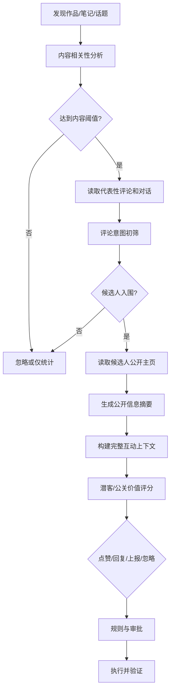

# 08 潜在客户识别、上下文理解与互动策略

## 1. 目标

逛街和公关模式不对所有内容、作者和访客无差别点赞或回复，而是优先处理：

- 与商家服务范围高度相关的人。
- 已明确表达问题、需求、购买时间或本地位置的人。
- 正在主动寻求建议并愿意继续对话的人。
- 与品牌负面事件直接相关、需要及时回应的人。

核心原则：**先理解内容，再筛选评论，再复核公开主页，最后决定是否互动。**

## 2. 两阶段候选筛选



只对初筛入围的人访问公开主页，避免在大量无关用户上消耗资源。

## 3. 内容层分析

### 3.1 必须读取的信息

- 平台和内容 ID。
- 标题、正文、字幕或视频 OCR 摘要。
- 作者公开名称、认证状态和账号类型。
- 发布时间、公开地点、话题标签。
- 点赞、评论、收藏等公开互动摘要。
- 内容是在咨询、分享体验、投诉、测评还是纯娱乐。
- 品牌或门店是否被明确提及。

### 3.2 内容角色

- `OWNED_CONTENT`：商家自有内容。
- `BRAND_MENTION`：明确提及品牌/门店/产品。
- `LOCAL_DEMAND`：本地用户提出相关需求。
- `INDUSTRY_DISCUSSION`：行业话题但未提及品牌。
- `COMPLAINT_OR_RISK`：投诉或潜在舆情。
- `COMPETITOR_OWNED`：竞品自有阵地。
- `IRRELEVANT`：无关内容。

竞品自有阵地默认不进行营销回复。

## 4. 评论和对话层分析

每个候选互动至少读取：

- 目标评论完整文本。
- 父级评论或被回复对象。
- 当前线程已有回复。
- 能代表整体语境的相邻评论摘要。
- 作者是否已经回应过相同问题。
- 商家账号是否已互动，避免重复。

评论角色分类：

- `CONTENT_CREATOR`：作品发布者。
- `EXISTING_CUSTOMER`：明确描述真实消费经历。
- `POTENTIAL_CUSTOMER`：询问价格、地址、效果边界、预约或推荐。
- `INFORMATION_SEEKER`：求知识但购买意图不明确。
- `PEER_OR_PROFESSIONAL`：同行或专业讨论者。
- `SUPPORTER`：正面互动但无需求。
- `COMPLAINANT`：提出投诉或负面经历。
- `BYSTANDER`：围观或泛讨论。
- `SPAM_OR_IRRELEVANT`：广告、灌水或无关内容。

## 5. 公开主页复核

### 5.1 可读取信号

- 平台公开 ID、昵称和头像类型。
- 个人、品牌、机构或媒体账号类型。
- 认证状态。
- 公开简介和公开地区。
- 近期公开内容中与当前话题直接相关的标签和陈述。
- 公开发言中是否重复表达同类需求。
- 是否已经公开声明为本店客户、同行或合作方。

### 5.2 不允许推断

- 不通过头像推断年龄、性别、民族、健康、收入、家庭状态或职业。
- 不做面部识别和真人身份查找。
- 不把不同平台的账号自动关联为同一人。
- 不从非相关历史内容推断政治、宗教、性取向、疾病等敏感信息。
- 不把“性格、消费能力、容易被说服”等心理标签作为互动依据。

系统生成的是“当前话题下的业务需求摘要”，不是永久人物档案。

## 6. 潜在客户评分

```text
LeadPotential =
  0.28 * ExplicitIntent
+ 0.18 * LocalFit
+ 0.15 * ServiceFit
+ 0.12 * TimeUrgency
+ 0.10 * ConversationOpenness
+ 0.07 * PublicSignalConsistency
+ 0.10 * BrandSafety
- Penalties
```

### 6.1 评分项

| 维度 | 高分信号 |
|---|---|
| 明确意图 | 直接询问价格、地址、预约、项目选择、到店时间 |
| 本地匹配 | 公开地区、内容地点或评论明确处于门店服务范围 |
| 服务匹配 | 需求与商家真实提供的项目相符 |
| 时间紧迫 | “今天、周末、近期、马上”等明确时间表达 |
| 对话开放 | 主动提问、追问、回应他人建议 |
| 信号一致 | 评论、简介和相关公开内容没有明显矛盾 |
| 品牌安全 | 互动不会进入竞品阵地、敏感争议或不适合营销的场景 |

### 6.2 扣分项

- 内容与商家关系弱。
- 明确拒绝营销或仅讨论个人经历。
- 已有多人重复推荐商家。
- 账号是竞品官方、营销号或疑似无关广告。
- 评论涉及伤害、隐私、退款或重大投诉。
- 需要依赖敏感属性推断才能得出结论。

### 6.3 决策区间

阈值按平台和商家试点数据校准：

- 高分：生成一对一回复草稿并进入审批。
- 中分：只点赞候选或收藏为线索，由人工判断。
- 低分：不互动，仅用于趋势统计。
- 风险命中：不营销，转入公关或客诉流程。

## 7. 公关价值评分

公关模式不以成交为首要目标，使用：

```text
PRPriority =
  0.25 * BrandRelevance
+ 0.20 * ComplaintSeverity
+ 0.15 * EvidenceClarity
+ 0.15 * SpreadPotential
+ 0.15 * ResponseNecessity
+ 0.10 * AuthorPublicInfluence
```

“公开影响力”只使用认证状态和公开互动量，不根据职业、财富或身份猜测。普通用户的真实客诉即使影响力低，也不能因此忽略。

## 8. 点赞决策

点赞与回复分开决策。

### 8.1 可以建议点赞

- 真实表扬、建设性反馈。
- 与品牌价值一致的专业补充。
- 用户提出清晰且有代表性的问题。
- 作品作者发布与商家相关的正面、真实内容。

### 8.2 不自动点赞

- 投诉、伤害、过敏、隐私和退款内容。
- 未核实的负面指控。
- 竞品营销内容。
- 与业务无关的热门评论。
- 可能被理解为商家认可争议事实的内容。

没有官方写能力的平台，点赞只显示为人工建议。

## 9. 回复策略

### 9.1 回复作品作者

结构：

```text
回应作品具体观点
→ 提供一个有价值的事实或专业补充
→ 必要时说明商家身份
→ 给出平台内、低压力的下一步
```

不使用泛化的“欢迎来店体验”，除非内容明确询问相关服务。

### 9.2 回复评论区访客

结构：

```text
直接回答其问题
→ 结合公开地点/需求给出适配信息
→ 必要时说明限制和条件
→ 引导查看平台内门店页或继续公开提问
```

### 9.3 回复负面参与者

- 先区分亲历者、转述者和普通围观者。
- 对亲历者进入客诉和事实核实流程。
- 对转述者只澄清可验证事实，不要求删除观点。
- 对普通围观者不逐条争辩；必要时发布一次统一说明。

## 10. 上下文包

生成回复前必须构建：

```json
{
  "content": {
    "title": "...",
    "summary": "...",
    "authorType": "PERSONAL_CREATOR",
    "location": "公开地点",
    "publishedAt": "..."
  },
  "target": {
    "role": "POTENTIAL_CUSTOMER",
    "comment": "...",
    "parentThread": ["..."],
    "neighborSummary": "..."
  },
  "publicProfile": {
    "accountType": "PERSONAL",
    "verified": false,
    "displayedRegion": "...",
    "relevantSignals": ["..."],
    "expiresAt": "..."
  },
  "brand": {
    "store": "...",
    "availableServices": ["..."],
    "approvedFacts": ["..."]
  }
}
```

## 11. 频率与任务调度

频率控制用于保证互动质量、避免误操作和遵守平台规则，不实现随机化行为或检测规避。

### 11.1 互动预算

按以下维度分别配置：

- 平台。
- 账号。
- 门店。
- 点赞、回复、私信等动作类型。
- 自动、人工确认和纯人工通道。
- 工作时段和负责人在线状态。

### 11.2 调度原则

- 高潜客户和 P0/P1 风险优先。
- 同一账号写任务严格串行。
- 先完成阅读、评分和审批，再进入写队列。
- 人工正在操作手机时暂停 Agent。
- 达到内部预算后只继续分析，不再创建写任务。
- 平台出现警告、删除、异常验证或成功率下降时进入只读模式。
- 不因为积压任务在短时间集中补发。

### 11.3 状态

```text
ACTIVE
→ QUALITY_LIMITED
→ READ_ONLY
→ COOLDOWN
→ MANUAL_REVIEW
→ STOPPED
```

恢复必须由健康检查或人工审批触发，不因等待一段随机时间自动继续。

## 12. 平台差异

| 平台 | 推荐方式 |
|---|---|
| 抖音 | 通过审核的品牌关键词 API 优先；公开主页复核只用于入围对象；低风险回复也建议先灰度人工审批 |
| 美团/大众点评 | 重点处理自有门店评价；不去其他商家评价区营销；公开信息主要用于客诉归属和门店服务改进 |
| 小红书 | 以搜索辅助、候选摘要、草稿和人工确认为主；不后台批量点赞和评论 |

## 13. 数据保留

- `public_actor_snapshot` 默认短期保留，任务结束后按租户策略删除。
- 保存公开信息摘要和证据来源，不无限保存完整主页截图。
- 公关证据因事件需要延长保留时，必须关联 `incidentId` 和保留原因。
- 不建立跨事件、跨平台的长期个人标签库。

## 14. 评估指标

- 潜客候选 `Precision@K`。
- 草稿人工接受率。
- 回复后有效继续对话率。
- 无关回复率。
- 重复或模板化回复率。
- 点赞/回复人工撤销率。
- 平台警告、删除和账号异常率。
- 负面事件首次发现时间。
- P0/P1 漏报率。
- 敏感属性误推断次数，目标为零。

